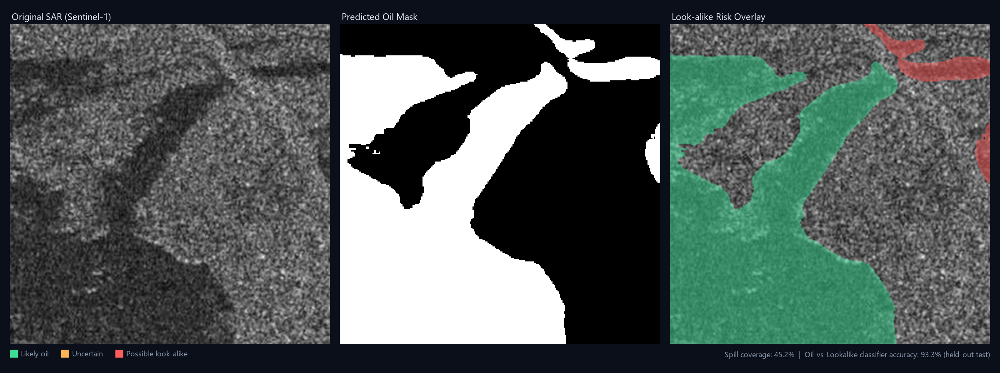

# Oil Spill & Look-alike Detection (SAR)

Detects oil spills in Sentinel-1 / PALSAR SAR imagery, then scores each
detected region for how likely it is to be a **look-alike** (a natural
phenomenon — low-wind zones, biogenic slicks, rain cells — that mimics oil's
dark radar signature) rather than real oil. Ships as a Flask web app with a
GeoTIFF-aware map view.



## Why this is hard

A SAR image can't "see" oil directly — it sees smooth patches that dampen
radar backscatter, and oil is only one cause of that. Anything else that
calms the sea surface (wind shadow, algae, biological films) produces the
same dark signature. Telling real spills apart from these look-alikes is
the actual difficulty in SAR oil-spill detection, not finding dark patches
in the first place.

## Pipeline

```
SAR image -> U-Net segmentation -> binary oil mask
                                        |
                                        v
                          connected-component "blobs"
                                        |
                                        v
                    shape/texture features (circularity,
                    elongation, edge sharpness, interior
                    homogeneity, ...)
                                        |
                                        v
              trained classifier -> oil vs. look-alike risk
```

1. **Segmentation** — a compact U-Net (256×256, `base=16` channels) trained
   on combined PALSAR + Sentinel-1 binary oil/no-oil masks.
2. **Look-alike scoring** — each connected component of the predicted mask
   is reduced to a small feature vector (compactness, elongation, boundary
   sharpness, interior texture) and classified as `likely_oil`, `uncertain`,
   or `possible_look_alike` by a trained classifier.

## Results

### Segmentation (U-Net, val split)

| | |
|---|---|
| Train / test samples | 6,455 / 1,615 |
| Best val IoU | 0.6494 |
| Tuned threshold | 0.40 |
| Recall @ threshold | **90.4%** |
| Precision @ threshold | 76.1% |
| F1 @ threshold | 82.6% |

The threshold is deliberately tuned for high recall — missing a real spill
is costlier than a false alarm.

### Oil vs. Look-alike classifier (held-out test images)

Trained on 150 real "Oil" + 150 real "Look-alike" Sentinel-1 scenes
([Zenodo 10.5281/zenodo.13761290](https://doi.org/10.5281/zenodo.13761290),
CC-BY-4.0), evaluated on a 25% held-out split by source image (no leakage):

| Model | Accuracy | Precision | Recall | F1 |
|---|---|---|---|---|
| Fixed-weight heuristic (previous approach) | 46.7% | 25.0% | 2.6% | 4.8% |
| **Trained classifier (Random Forest)** | **93.3%** | **92.3%** | **94.7%** | **93.5%** |

The look-alike images' provided ground-truth masks are empty by definition
(there's no oil to mark), so each image's dominant dark patch was detected
directly (Gaussian blur + low-percentile threshold + morphological cleanup)
and used as the ground-truth look-alike blob — the same pattern a naive
detector would otherwise mistake for oil. See
[`train_lookalike_classifier.py`](train_lookalike_classifier.py) for the
full methodology.

## Setup

```
pip install -r requirements.txt
python app.py
```

Open `http://127.0.0.1:5000`, upload a SAR image (PNG/JPG or GeoTIFF), and
get back a predicted mask, spill coverage %, and a look-alike risk overlay.
GeoTIFF uploads also show the detected location on a map.

The app only accepts grayscale SAR-like input — it checks color saturation
and rejects ordinary photos outright instead of guessing on them.

## Retraining

```
python train.py                        # retrain the U-Net segmentation model
python train_lookalike_classifier.py   # retrain the look-alike classifier
```

Both expect their source datasets under `dataset/` (PALSAR + Sentinel-1
binary masks) and a Zenodo Part III extraction respectively — see the
docstring at the top of each script for the exact layout. Neither dataset
is committed to this repo (too large); `best_model.pth` and
`lookalike_classifier.pkl` are the already-trained artifacts, so retraining
is optional.

## Project layout

| File | Purpose |
|---|---|
| `app.py` | Flask web app |
| `model.py` | U-Net architecture |
| `train.py` | Segmentation training + threshold tuning |
| `dataset_utils.py` | PyTorch `Dataset` for the segmentation training data |
| `lookalike.py` | Blob feature extraction + oil/look-alike scoring |
| `train_lookalike_classifier.py` | Trains the look-alike classifier from Zenodo ground truth |
| `geo_utils.py` | GeoTIFF geo-referencing (no GDAL dependency) |
| `best_model.pth`, `threshold.json` | Trained segmentation model + tuned threshold |
| `lookalike_classifier.pkl` | Trained look-alike classifier |
| `templates/index.html` | Web UI |

## Limitations

- Small look-alike training set (150 images/class) — real-world variance is
  likely wider than what's captured here.
- Segmentation threshold favors recall over precision by design; expect
  some false positives.
- Only VV/single-channel SAR intensity is used; dual-pol information isn't
  exploited.
